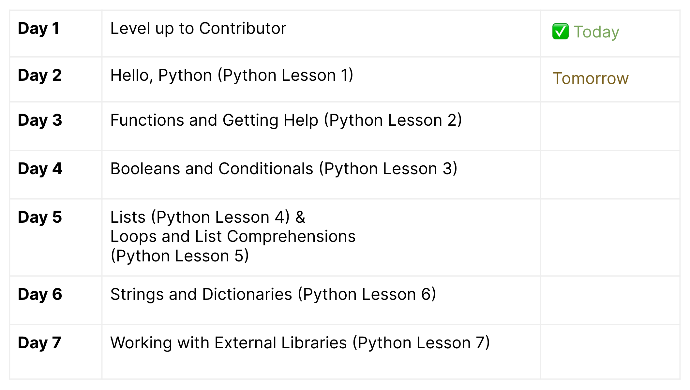
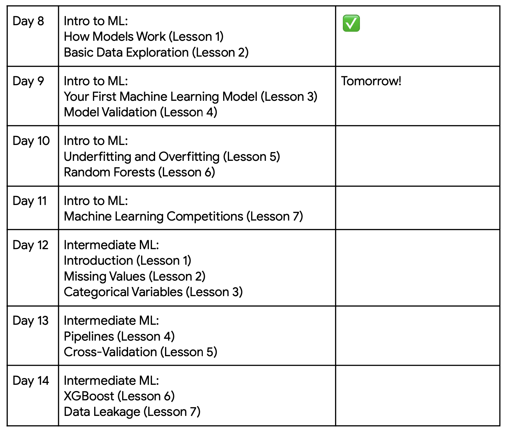
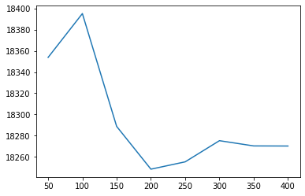

# Kaggle - 30 Days of ML

- [Kaggle - 30 Days of ML](#kaggle---30-days-of-ml)
  - [Week 1: Python Basics](#week-1-python-basics)
    - [Day 1: Level up to Contributor](#day-1-level-up-to-contributor)
    - [Day 2: Hello Python](#day-2-hello-python)
    - [Day 3: Functions and Getting Help](#day-3-functions-and-getting-help)
    - [Day 4: Booleans and Conditionals](#day-4-booleans-and-conditionals)
    - [Day 5: Lists, Loops and List Comprehensions](#day-5-lists-loops-and-list-comprehensions)
    - [Day 6: Strings and Dictionaries](#day-6-strings-and-dictionaries)
    - [Day 7: Working with External Libraries](#day-7-working-with-external-libraries)
  - [Week 2: Machine Learning & Basic Data Exploration](#week-2-machine-learning--basic-data-exploration)
    - [Day 8: How Models Work](#day-8-how-models-work)
    - [Day 9: Your First ML Model & Model Validation](#day-9-your-first-ml-model--model-validation)
    - [Day 10: Underfitting/Overfitting & Random Forests](#day-10-underfittingoverfitting--random-forests)
    - [Day 11: Machine Learning Competitions](#day-11-machine-learning-competitions)
    - [Day 12: Missing Values & Categorical Variables](#day-12-missing-values--categorical-variables)
    - [Day 13: Pipelines & Cross-Validation](#day-13-pipelines--cross-validation)
      - [Step 1: Define Preprocessing Steps](#step-1-define-preprocessing-steps)
      - [Step 2: Define the Model](#step-2-define-the-model)
      - [Step 3: Create and Evaluate the Pipeline](#step-3-create-and-evaluate-the-pipeline)
      - [Step 4: Visualize scores (Optional)](#step-4-visualize-scores-optional)
    - [Day 14](#day-14)
  - [Week 3:](#week-3)
    - [Day 15](#day-15)

--

## Week 1: Python Basics


### Day 1: Level up to Contributor

 Today, you’ll set up your Kaggle account, move up from Novice to Contributor, and even make your very first submission to a Kaggle competition! The assignment should only take 45 minutes to complete.

 Also, you’ll be able to jump into our Discord community & connect with other learners. It will be a great resource to ask questions and get help from others.

* Follow the instructions in [this notebook](https://notifications.google.com/g/p/AD-FnEz8bhmh9JJEvNrS-CuBtJFLOeFX8tAgNJJHtgmjn2SaUynILgYzUBLPOFKODEm8NK9B1QCrQ73oGzgqm-UXc8TA7N2DG-xIe9v2W3N3h2_G4VAMyyPMOtigBbPaqCW1munx6LtDRVYE20qBe00CA-KF1yPxcPGalxh74Iwil85-xK-3__-b5L3FZG2KZZTk_WepQJDI31gasT_FqJRPFEBue_fBCdstjna_fOzYDRjy2h2127-z) to get started with Kaggle.

* [Join 30 Days of ML Discord Community](https://notifications.google.com/g/p/AD-FnEzKkMbCxdfq2blB3ABDaDUkvn5I1JhGM8TSVVPGquAAl2z8FxhrAwP4F920eKpK2hx8uWvVm7qvuZ1Sifv5_E3w) and introduce yourself in the #introductions channel

--

### Day 2: Hello Python

 In **Lesson 1 (Hello Python)**, you’ll get a feel for Python syntax, and learn how to work with variables and do arithmetic in Python.

* Read this [tutorial](https://notifications.google.com/g/p/AD-FnEwY5POHCqgMRxGlgwsO-f2QmnR5g5xexFTmCQO3tdTn6PC37ZQloPbZr9_LzFNubnDoxzWan6uHNauPXU1MhFsru-PCpGSy1A6C_KK8TS-p3Hs-lnCGiZZzSvN93k7DidGpv12zbeLoshHNbOxKUkUZVUBoVRM5wg8WAw0X3wo6iqw8pP57gnn5ls8MTg2DZkcBMdekufNX_NEk6D0lYtLO2JklZIfS) (from Lesson 1 of the Python course)

* Complete this [exercise](https://notifications.google.com/g/p/AD-FnEwK4Spvdh2w9KFthW6PxFlpkgyXob1hIkWDKXpCry216ODSeW6tTjzazsjD65ZS5no2iAxK6k2-BtErGnQ91WmV39okyBsw4y7VgofVwdZoladMgoHXSSpSQtBqz4dkI1oZQMH9zJRmMeKZJCKcoCoEVpE4F5RKiHs_WP2srMI2ZVTLQhZBzJLln8R8_ZzlKf3QI3nEY8Yp-sLD9d0y4QuLrw) (from Lesson 1 of the Python course)

--

### Day 3: Functions and Getting Help

 In **Lesson 2 (Functions and Getting Help)**, you’ll learn how to work with functions, which are reusable blocks of code designed to perform a task. You’ll also learn how to write your own!

* Read this [tutorial](https://notifications.google.com/g/p/AD-FnEwdLY9KM-s2c8Mqd9VZFHU-Lw4Vhm61vpO_RBkf42kvhiHbCbfthuz4ksvgZr_x1e1pBNmSUJTudBy_zuV6UG6EWvrDg3WGhzDyQuIzin7MnYhzvTyOz-YYAqXMDtUABXf8PzxVm7eWrTm9YOYh6BdjT8cTV_7pUO_fBQAs2hqwK0Lldbt1Q-p2PLRl3LUlVzU2ioXSC_HU9UvcaHJUXn-IunK7ig22r8xVPwC0M_prnYN7Upo) (from Lesson 2 of the Python course)

* Complete this [exercise](https://notifications.google.com/g/p/AD-FnEyyRfSCqzETaGz4vf0d1gaocdokvmQU1DdWy-nPIl8ivliWV3770jJ2HpYMLZIBoMJQ960qgsCDqKDxvmybcVazt2pjdXFF_EHlJfQBUoiWaKjfSKT0KBN2tTXGqMhdVKRVfocyItO_NkaFfJVP-Pl0s32lfmwR-GdBNUObcY5yTRStLbgKkxqXONeNUE4u573A8Xmn7RHRyeAkqdNTjFt8ig) (from Lesson 2 of the Python course)

--

### Day 4: Booleans and Conditionals

 In **Lesson 3 (Booleans and Conditionals)**, you’ll learn all about the Boolean data type, which allows you to represent “True” and “False” in Python code. 

 This will provide a strong foundation for understanding how to write conditional statements, which are used to modify how code runs based on whether certain conditions hold.

* Read this [tutorial](https://notifications.google.com/g/p/AD-FnEzD9efNe4NLH_cOZ7eY_051UtQ3yAWRuNfJUR0jEvhba_pIup0R96Ii8S8eJcxCRfljfb13ejyv9IzNqSUdo1Xk_l58JR7mxUtoQ3jYMspBIeCE5vXM_0p0VaQHq-3oCxF0445rg0rZ4xSlEK-LuJ6-YiOErmHew8Cm3T0jGa1tymk8JFEtT6XwlAogZUa4x90-zypHHXLAcV5ouR8PSNw_SCWzMvt0zxGsIriQYnn5KVckwQ) (from Lesson 3 of the Python course)

* Complete this [exercise](https://notifications.google.com/g/p/AD-FnEx2rh1-NCshM46smvX_L-6QeSfpVUTDXUEIrNl-quOo3up2DspY8F4VU4Q6NUPcnUKPVPGvVEs8a6xscW12lUxUGDusiilf_Efmooe3tprPvPHaSIbkzRmXbRZfZwz8haIMSxPOOM8zSfno9gDEwRpXyq8yPV3X1M-thIDv6D6TABJPBVcLQ4YGumycMxGSnCLgSGcBwXwhpb8mCBpJEu4t3w) (from Lesson 3 of the Python course)

--

### Day 5: Lists, Loops and List Comprehensions

 In **Lesson 4 (Lists)**, you’ll learn how to use Python lists to store ordered collections of values. Lists are incredibly useful when writing code to manage several related variables.

* Read this [tutorial](https://notifications.google.com/g/p/AD-FnEz5jeD_PQr9Z0sQlfjMltn-tUE1LdmTwmCBga18KQMS0pog-UUpXLxcWOcuhRuCN9m1S3LXRxe0McVI1F_idlZaVaF_2SFViI0RTKzKIPLzqJ2Tvf9khdrrUuXQjyHEjb6xqC9kAoBWH4D3eHWoRhss9aMJhhch4afQ1uG4LNubqHaEZ5Bjb_0kixzd67NyWGpZJM7yejwuDf_MIWgaZh8) (from Lesson 4 of the Python course)
  
* Complete this [exercise](https://notifications.google.com/g/p/AD-FnEwMN7qRISEmcl5r0SsMG2XkWyMRZn93_1zPi6Pcx3INpfsfUZBnxp0TbLELysGWGLscWRE_azCmolRz5IY3cwvR7dhU-GAdlNo5dlz1ceWGCEWdgcVn5o9b1IwKuof6zubY3vZXl4b7KGukrf6JQ7rDD0L-zWh7c1DU6mN8MtizA5KaxrZDk3kD1HSt4DfIKKDeRpxsNnIE-821CyY5PJJujNM) (from Lesson 4 of the Python course)

 In **Lesson 5 (Loops and List Comprehensions)**, you’ll learn an efficient way to repeatedly execute code. With list comprehensions, you’ll often be able to condense code that would have taken several lines to just a single line!
  
* Read this [tutorial](https://notifications.google.com/g/p/AD-FnEz6pWtRHDbL830dBMEIkywgV4JWM0U-IhBxqYaA0W3lt2_AWriE5E6XhL81kUEBq_4U2TV-E6WL-5cvBfGPhuHXHEr42rqW9RfSOb9vqQE2iRG0mdLXFMfMHmqTdKERAQhCoBM3e4aJ78k5L8uF1DCeCTl2lDp5hsNjxj_fjNo-YAD5DZYu5WDpDt4LMopSMjOmSmDss7qQRD1VjOdT_SL2F83u0XtyWEx2zz0ensiBNsaxbu2226NS) (from Lesson 5 of the Python course)
  
* Complete this [exercise](https://notifications.google.com/g/p/AD-FnEykbkcyJJNsgKckmvgg1wh_SVo4CJNzwnXqd7XiETOmB2tgfgXBSL_b271BmEHqC5syw_FxZJ24g6N1WjoseCHcX10C_AOu66t2PdLaQa5MnnVrlKLdg9tv5xdyrs-HVWNXp8yPvYTBPE7Q_sVtt_qw-8BIA9L56M3BvLV0_ELfm983xgG53hQtZuXaI8Xaiet8MIHLO2d1s1g2KJUJ3354H7I) (from Lesson 5 of the Python course)

--

### Day 6: Strings and Dictionaries

 In **Lesson 6 (Strings and Dictionaries)**, you’ll learn about strings, which is a data type that is useful for representing human-readable data, such as text. 

 A dictionary is another new data type, that is similar to a list, but with important differences that makes it incredibly useful in its own right.

* Read this [tutorial](https://notifications.google.com/g/p/AD-FnEzK0oQRblvrVYNrbftg9HrqQLehOsKRh_gYMtC8_BHlQiJWh6IxyI6U6E_QnxuaOUuFnMWmO3ZhdB8bu7kW1tZWHF5gHmrOtIyj_Z98PxBEiammiWlq5B0EIBAqvmln26XYJ5XKz-1-CG7AfIr6AVzaHF-Is4BbhUj2bQxotoroxc5F-jpWZoyX4jjEkpywONCrsZOfaHKpL_MGhQYtH4bEG1rAr-GrWByix54NNoaY3L5meQ) (from Lesson 6 of the Python course)
  
* Complete this [exercise](https://notifications.google.com/g/p/AD-FnEwdLzZ1Oue_Ik1-SfAqcJDEAnIzHyCAOk2I4QbhO6LYRgvtoCfG-RcISN9qycox5Sjyleb5cs-Xzfpk40HwQ0gzIPXvIRwqKSPJ9b7nN__L5SY3ocWuV5ZRmEKAbWF3lV0cWYYVtibKYDLZ-cmDlw3vEJVdkJ3HqnCi90xTyO8DiL86eGO7PBMvK0YaGfuOLDWrYBA7tnJMtM9uoxyQItXNzBE) (from Lesson 6 of the Python course)

--

### Day 7: Working with External Libraries

 One of the best things about Python is the vast number of high-quality custom libraries that have been written for it. In **Lesson 7 (Working with External Libraries)**, you’ll learn how to access this pre-written code and use it in your own work.

* Read this [tutorial](https://notifications.google.com/g/p/AD-FnEwQe_MZhpJ6isxvAAaWTVBGIOtLO0h7Q9y7PFwccdjUgArM1kStXR4URK268ArnFuvMzwMgV8esi8U0yeJOnGqOqc0lQspIzDWmTgJ6-BkoJDrsruCStzC5cxDyEdi2SyVS7kaBrKK2xsZY1mSwuCDnz9IfP_mdy2N4PywA20_WpMUyC7puKNk4eKRCGrW0-dpxSRtL9NqUU4JIcaGK3rsCniVG8iGvhkzGellIBEqVScRtbFmOZ4dRFg) (from Lesson 7 of the Python course)
  
* Complete this [exercise](https://notifications.google.com/g/p/AD-FnEwHM_kXNrnqkQYLn6lJYNLMz_E7dhjEHQyKOO8DnCtYuvQx_NEeGBusH8gf4NXxFdeeVMyzihv2aCt63a7Cvkwjfhf6BRufzcg9-Ep2e8865mznUA3p3I2_PyJd_EYTwvWgJV5ug5XmaDT4hZKtZ02Tn92I27eWUBVDfvW9GivzUibGLq3PWt53GHTioP4o0C-rgfn6Tv5xila8X5aMFOaU5Q) (from Lesson 7 of the Python course)


---

## Week 2: Machine Learning & Basic Data Exploration


### Day 8: How Models Work
 In **Lesson 1 (How Models Work)**, you will start at the very beginning: what exactly is “machine learning”, and how is it used in the real world? 

 You’ll learn the answers to these questions and explore the basics of decision trees, as you start to build a strong foundation for some of the most cutting-edge techniques in data science.

* Read this [tutorial](https://notifications.google.com/g/p/AD-FnEyLeDIZmtwhoVYRGrXElKKQPZmHuyVqcAMdJBfB2bBK75lve5Pi171T2GS-1Y0OtE1F9b6aJs54XIBxh2hMO-hR4wb56VgGR2j5d1qyJQgZB2LTwFRSyzsCEm90VLh2-BcWFeecainuNYPTGChI3lghZhS3zZtCed1dl9CE76qkV7N9_-9QeTn96ZT1AQmfk43gVH2KCtx_0b86XTOUReKIHrLzTFUZYE0) (from Lesson 1 of the Intro to ML course)

 In **Lesson 2 (Basic Data Exploration)**, you’ll learn all about pandas, the primary tool used by data scientists for exploring and manipulating data. Then, you’ll use your new knowledge to examine a dataset of home prices.

* Read this [tutorial](https://notifications.google.com/g/p/AD-FnEyOUWgXudyC8on4_TDUuegzptFC-nexiM_Yz7vTtCjPze88EnqqB_2igm3g3sGzgapIceZQ0AwOQYyAYGUL9E7ExPYxsqzbgBKQcKpsUAsoDrEbQQKZo3OWcQqyJyUd2LFRW_ErE0Jnl2y2BikChU70nWg-cFI8gfv2ARpMQQNafIWWkXZbgrIyzaH8WiSsrIBh3EKTgxhNYQOgmTTo7vazGVTPkJNJkcSZCGzC2_FU) (from Lesson 2 of the Intro to ML course)

* Complete this [exercise](https://notifications.google.com/g/p/AD-FnEyEp8uvnbgGW2UMCzrL-vN_GOGeVZYvoI2nJrXC-oOecRgmurx3DXxvA6pgA5PQeyS5OEx_W6ndpRLojFE42W34ZrzcNl9FwXkC_dQA3ziFqoK-jHHg7j-fc20fhgzSBCOb2GgzjNuum-Mmd6_YzCD-x8Tny8hMexN6qlkMxrMGk7HZlWZ7PE3mYHM6d81Ug_7COW9BxN6iZxm8dJuOvCWYtg) (from Lesson 2 of the Intro to ML course)

--

### Day 9: Your First ML Model & Model Validation

 In **Lesson 3 (Your First Machine Learning Model)**, you’ll create a machine learning model using the ***scikit-learn*** library, one of the most popular and efficient tools for data analysis.

 Along the way, you’ll learn some basic techniques for working with very large datasets. These skills are especially important for modern data scientists, who often work with “big data” containing millions of variables ― many more than a human can conceivably understand! Thankfully, machines excel at discovering useful patterns in datasets that are too large for humans to wrap their heads around. :)


* Read this [tutorial](https://notifications.google.com/g/p/AD-FnEw3URQCA9SnFTAQAxZ39_-vIzRdFa_c2V3n5y3C_ZhgisUiW6K4fPVEXXPGI4bBOu5-qoyhRTajhqFn6Cio4Z1gVlf87qUig8ErjIcs8uoMXaD_XcWh1-tSuAbA3ER3V1qyiPCgIx2mNgvXoJxbR9c1X9bDunl3luf8o7iNvimHIThmg5f1qWC-2ujUFob-Gu4HVjKj2b3IiEYasrY9gbmv1OqvAk5sjxOdhxejQpSeOdgHZLFkjlGe0uDE) (from Lesson 3 of the Intro to ML course)

* Complete this [exercise](https://notifications.google.com/g/p/AD-FnEzWoBt98mB-XLjPVxKEZzFMsn63E7IDjedI8es5FkpHeb4CLQiDe3kY7YVDivTYQCMdB7TkjWTRKtFwyPppEh4oxIdx7ZSo4NttlqpWw0i7zWzDaebHoShdJ2YB1XiQ4kqfkshD2FF40GUwOkJGvXbAElWgTYLeP0RLkg2zQybCg57T19q1oUq492yO_3V0RyZUqCUzgceA3Hxdykg0YMrUULA) (from Lesson 3 of the Intro to ML course)

 Once you have built a model, how good is it? How exactly should you judge how close the model’s predictions are to what actually happened? In **Lesson 4 (Model Validation)**, you’ll use model validation to measure the quality of your model.

* Read this [tutorial](https://notifications.google.com/g/p/AD-FnEx8Yt0wVJ6TsHtGBO7zSsykfrba-VGYLtD5-sm6L0QnrbNdW_8iVvPlc2q-IgR6sbapqtzvfMfzKxZukwdEKhqJ7QMi_I1JhQ1ur7oAr6UGOjWeTHflWaUUZnDusMHR8O4QywPcZB1gndM-oKA0oRXFlsN3JwlmvxV3lqCLlotGv8EPaOUz91OFPlre71mC6_mCDWEqMeAdX24IxwO1KiG3j6Wmcd4OSOzO9Q) (from Lesson 4 of the Intro to ML course)

* Complete this [exercise](https://notifications.google.com/g/p/AD-FnEyvp2vQe8NCWhFRzwwnAd8QZS604ENjU0KXjyouF2ziFX52dtQM8KJiOFzLW6Khq1TU2Mnx7KT6TG7SKYk1FNoJTjIvA9iQe-kuIAlxqgBdr0kKHM4hM8ajLFR2CYmJyZ8prGK40tnXif2p_c_9kDPjHyhh9Du9HF9YCbti8v9MolkbjNH3vPsoWiIShXLQiqtmN3jRyKvWScHZuzt_5V9yPhY) (from Lesson 4 of the Intro to ML course)

--

### Day 10: Underfitting/Overfitting & Random Forests

 In **Lesson 5 (Underfitting and Overfitting)**, you’ll learn about the fundamental concepts of underfitting and overfitting. Then you'll apply these ideas to gain a deep understanding of why some models succeed and others fail. This knowledge will make you much more efficient at discovering highly accurate machine learning models.


* Read this [tutorial](https://notifications.google.com/g/p/AD-FnEwuFz2LVgfeZy_tkA-RnuTmGjITUmc1TDvRicBMqFO6PY05JW9ONWyp0ibjPLppegK1S6OXn0r5oCcE788y1siDt8DB-8MtrnarKiGV3ZUIpnDX5OrUPqaB8ECyp0bxj7VL6nUxjm2SY_3zoJ1tfv48a_jzFpVOoEaimAr_LZ49q6zSr2rstZrhBlMnt5kEnRJuCEmSY4WYnw-Ofwy1Ja3_oaYK5L4VXW0NiPeIWAuw0dUlrxAQ6g) (from Lesson 5 of the Intro to ML course)

* Complete this [exercise](https://notifications.google.com/g/p/AD-FnEx_9Ztnu1I6XPboL0dq6vyOUd9UxeITRQLWPwHFb-jgcjclfB7zHXsietaGvISdEncGEfXUepzj82sKuVXpj43zVWlkagvmGoGGnTKNG1XTy1h5vIMyaMg-P4jqKVGusZh18Txh4amWAPDvG39wKOeUp0ziiDoDI4rMFpoz7XR6e87nYjWTrtQUlQepzdYDcfTL1GY97B5BwIKxsaeZ1oC4ySU) (from Lesson 5 of the Intro to ML course)


 In **Lesson 6 (Random Forests)**, you’ll learn all about random forests, another machine learning model you can add to your growing toolkit. Then, put your new knowledge to use immediately by building your own random forest model that exceeds the performance of the models that you’ve built so far!

* Read this [tutorial](https://notifications.google.com/g/p/AD-FnEzsBdAGBN8EVf_eHx9GAC8Tm_TNWoG_yjV1YFU8lKvAdCUNARtFndDCxHAmYZOpVoI0trsuUSvq_QZUHPLwS84VAQ1l1y1Hq7l60jLj9AHNeeOHALWMwPURoWSlCMEN9bUxgbW7u7cjRC6KPzamhrIBTxYNouylw7Y_B781Esdso9UroOlXwf-zaj-gZ0Gc6qvifir32kLXCFdJDzUGnWl5IkzwCrD4egA) (from Lesson 6 of the Intro to ML course)

* Complete this [exercise](https://notifications.google.com/g/p/AD-FnEwhDV0s6j2emtTCNegBKjenk0oBg2RGeJPYEBTHoIhHbN01eVL8ExaHjbKAb4HYZmpZxZiDX2NHcMHYaXg2soFZVgjCiIy2PTy3THz0cDiGiO5gXO_uUzoqYlZfg8i-0Ze93B8Ux9SnoTYpdn8AkRRkrSRbKrmQ656bGOL-W8_4mKXQ_4YnZBVjDMzgvgf31BV_4Pa1-P5rC9bGdRb7TGf6GhM) (from Lesson 6 of the Intro to ML course)

* Conclusion
  
  * **Overfitting**: capturing spurious patterns that won't recur in the future, leading to less accurate predictions. （分支過多）
  
  * **Underfitting**: failing to capture relevant patterns, again leading to less accurate predictions. （分支過少）
  
  * One of the best features of Random Forest models is that they generally work reasonably even without tuning. （隨機森林模型不加參數也有好表現）

--

### Day 11: Machine Learning Competitions

 One way to further improve your skills is to participate in machine learning competitions. In **Lesson 7 (Machine Learning Competitions)**, you’ll create and submit your predictions to a Kaggle competition.

* Read this [tutorial](https://notifications.google.com/g/p/AD-FnEzIg1itr5d9CjIye2nsyQU1MQP5kL_hgea7G-fe7KFXuP4mxtKHSCCKrg35eTYLKBtYJvrggdrvxe4zkWJVlPP7i7TPaEbZ2EXq4UWK2QoWr_ZWs4janTE-TZvUxsqY-c-A5flsE9Ix8YhOHH70BMmKI9L029Su_yNCPdBQRhIWRIShV4o_n7ukW9ANjEPK-X3DknHIIO8VIlKAEqTyOCrkpfUiknWyuWyqKMWtLfy3NEPo7g28EIy2) (from Lesson 7 of the Intro to ML course)

* Complete this [exercise](https://notifications.google.com/g/p/AD-FnEzU4TVntKibYgUr6h1R6fV8Lc_mL4y6_HdaUqyYDNrHzMKEU1y4SRM2eXubge27bImrkp3THh4iexkUC8IFdWr3zDqd9Xep8XHlSCMnAljLq07e_9kYAjUHnWIHXxnzsaxM7FsqYgGzfFkIHKifzOjcBszOsOFmQcFAtYv4iZYDL36ySAIY6Bw2OenGrj61J-tFwXVi3HN_W4GUfYlnFLutzsk) (from Lesson 7 of the Intro to ML course)

--

### Day 12: Missing Values & Categorical Variables

 In **Lesson 1 (Introduction)**, you’ll learn more about what the course covers.

* Read this [tutorial](https://notifications.google.com/g/p/AD-FnEyeGsz3NFzrpXUJmAnZqH-D9an2JS8U40vrQlaUUJgBJxC4Ye2xkfsG1JOAtkyIlIYT8fghKQWSC3qXqTVT6AJ_doxkkbHg6ECF8qInzHIFQOx3dHm9nzFbHtA4yEiQzYZNn_b32DHZZf9jecpzO98vI_Cn_NhjKpmtfQeyq6NKC3OX1UDwAn_rTwKDp-JVwQ2wFpaW8PnhUjZmfSTBoHZOH9JKQYMVSg) (from Lesson 1 of the Intermediate ML course)

* Complete this [exercise](https://notifications.google.com/g/p/AD-FnEykgsWzAkw9lvN7POIePKtQzC7WuHHhVX86KstgZmxQQhI__6pMjnnNgMhTk5QQQojt4d2mGu3Ygf5DIh4ARu2_0IsccmBO6CCAwtJrJk7Ko6-BvUtrS4ksyD3YjeiYIzgr37Fmkug8kPHreFNF-Ly3gmIl4lA-zwMtxzull8--W2IKYMKWQSuPsfuzuiRkiz_t6jqW1XsCim6OuySdv1yHUTg) (from Lesson 1 of the Intermediate ML course)

 Most machine learning libraries (including scikit-learn) give an error if you try to build a model using data with missing values. In **Lesson 2 (Missing Values)**, you’ll learn about three different approaches for dealing with missing values in your data.

* Read this [tutorial](https://notifications.google.com/g/p/AD-FnExo3m-7JQBh5lf35KCKBRlJ27CO852KvzcH_0J5KSYltZIfN0pTUrCI6L83_3R-t8u46gQ_lc9sNU5Iloqx93DzCabWBn1xSjZ76ya7unBXyPXZLti1i7_3B2idRTxgZpV8L4-F640BWiMkx_zC_-ci9BcKDWwve-pbDMproh5m7WD5DoNUGEgZPsCYVtvQXF3eJnpmQRSvWPK2-ceR3iV0V4WwtXO1waKy) (from Lesson 2 of the Intermediate ML course)

* Complete this [exercise](https://notifications.google.com/g/p/AD-FnEz2bXQjDo4qXt-jBxsMsRrOLOc6_9L9ZZzADgd_4chGwxzmtEsZWcya0MzbVMBLAAGdb_qPbChZzJ-g2IcuoEY2j2W1-3WOqHQ2hIktYWAMXybhkXlBZCdoPipjtZb1V-VyDu0ZlVcuHxUThe1_7w00PLVhysQilaeggRULM2OrIB_r9npS10LUEXa9mPsJaOCnxKGwXlYc844wTWruGirqnyQ) (from Lesson 2 of the Intermediate ML course)

 A categorical variable is a variable that takes only a limited number of values, and it’s common to encounter them in data. Learn how to work with them in **Lesson 3 (Categorical Variables)**.

* Read this [tutorial](https://notifications.google.com/g/p/AD-FnExVyHY12rfXOigYacJM2X2NVFo1zZ8KXLaEyhKdfDRsp_td2MDuQB2cg_RTzOovT5mjG4GvIgOf8Y_zQAGzO1n2ISshsdu09dlMunBU-ruZfXsCOvV86SWtieUOlckMErElQx4bjXVfKDR6TwT8eHZWBHzS2g25INPSClygUAY56mMKmUUClVYd0pLwtytnfob2pOysvO90nCzM2_oglj4RreoiK6439MIPsMTyd23CZw) (from Lesson 3 of the Intermediate ML course)

* Complete this [exercise](https://notifications.google.com/g/p/AD-FnEyZ7VAAE_z2HAmR0sZbdiHbw3ixjF9uK9ppmMSkB44i6M1MHQNOtHS0F3iy4LkBjaAW6zwI_mD2sQ2VytyWZFl_58Qc-qBqBwD0t0qIIRu87chC8vKibOBOldfaCT78CIJrqzaxS9cpV3WQhhA7fQXRk0qQIfXouyZ2ghHXqGvD5jdncjScYmUhWyNuZx6LrMQSNmElwmq4QQnewjVVlC4Fta4) (from Lesson 3 of the Intermediate ML course)

--

### Day 13: Pipelines & Cross-Validation

 In **Lesson 4 (Pipelines)**, you’ll learn a simple way to keep your data preprocessing and modeling code organized.

* Read this [tutorial](https://notifications.google.com/g/p/AD-FnExX--Gi2QawzoQSHU3Mnwy5ApZIlmF_aTky6ujcP_Fx8iaPuDFcPsVMqaDrFXI3U3KeIY_QVOhB5VDN1CY_-z5wX-xg0_Sbhr5ed0ovrlLNOct-dytrbvVJm0dMHv5eriAXwC0K483g_cqpN9DlfVJRQHqeWFb5gW1ndkrieNGnETChwpB3xCChP6uP__vdk418czdtLKVxqQ7ANm2X9OaEUjDrtS8) (from Lesson 4 of the Intermediate ML course)

* Complete this [exercise](https://notifications.google.com/g/p/AD-FnEyN0uAaUV5ERpaaJjIU4ipbYZSAzl1L05eALcqzR5MyDgfKIpp9KoyX11ZF9oj8LrgKrzCgU3BvsbWRYQCgI_1CKJKHg4JCwJSWap3_jwDGP_q1Ef8ynTGUZrh-9UndyGucNKS35TER0Gf7SFQU5DAzuz54GPUWSigci5SHyL7Gj-NqyU0U50F--ucT2cbq9hxaBqjT07Og2nYN077UcxJgj6VZ) (from Lesson 4 of the Intermediate ML course)

#### Step 1: Define Preprocessing Steps
```python
from sklearn.compose import ColumnTransformer
from sklearn.pipeline import Pipeline
from sklearn.impute import SimpleImputer
from sklearn.preprocessing import OneHotEncoder

# Preprocessing for numerical data
numerical_transformer = SimpleImputer(strategy='constant')

# Preprocessing for categorical data
categorical_transformer = Pipeline(steps=[
    ('imputer', SimpleImputer(strategy='most_frequent')),
    ('onehot', OneHotEncoder(handle_unknown='ignore'))
])

# Bundle preprocessing for numerical and categorical data
preprocessor = ColumnTransformer(
    transformers=[
        ('num', numerical_transformer, numerical_cols),
        ('cat', categorical_transformer, categorical_cols)
    ])
```

#### Step 2: Define the Model
```python
from sklearn.ensemble import RandomForestRegressor

model = RandomForestRegressor(n_estimators=100, random_state=0)
```

#### Step 3: Create and Evaluate the Pipeline
```python
from sklearn.metrics import mean_absolute_error

# Bundle preprocessing and modeling code in a pipeline
my_pipeline = Pipeline(steps=[('preprocessor', preprocessor),
                              ('model', model)
                             ])

# Preprocessing of training data, fit model 
my_pipeline.fit(X_train, y_train)

# Preprocessing of validation data, get predictions
preds = my_pipeline.predict(X_valid)

# Evaluate the model
score = mean_absolute_error(y_valid, preds)
```

 You’re already a bit familiar with model validation from the Intro to Machine Learning course. In **Lesson 5 (Cross-Validation)**, you’ll explore a more advanced validation technique that gives a better measure of model performance.

* Read this [tutorial](https://notifications.google.com/g/p/AD-FnEzgeYKZodbEen-sgLBnhyHmCx9aRMfMJ5cz0W2FcpJfo4DhO4xXAVvkC_k5vxM-f2XjhXMUOMn6d9flyjU0lbrWSW2BmoVoGIGpPzmmLoXcz4q745b9H0ilF34Li_U_j7MIrEIcv5M_0CjjpNq2Yyx7b6iqMx3syXjxtIIqAuP4yVraoUazINlIkol328xD7dPXP7B8_X8mXIp5r59RPXrIm5IHovhglzkRjaTF) (from Lesson 5 of the Intermediate ML course)

* Complete this [exercise](https://notifications.google.com/g/p/AD-FnEzyzZbgx_k1A_kBwKrXdbMaAE2M3ev-4jlxRNQ09tk5WxiyPRqtZOITmXZibUdsH4S8yzttPvtP6rlw60r3da_enUVSSSmcmq76kUPyyYovwIsV-G9NHN5zExQepgazqpZbAfcSjrq0twWwBOLZb148F-e-psnBXmFoj7ko04ny41p0pyA4Vfs4GuAzMVCOpKtRWez6JqTpXl8Yx775N3H1rlRW) (from Lesson 5 of the Intermediate ML course)

```python
from sklearn.model_selection import cross_val_score

# Multiply by -1 since sklearn calculates *negative* MAE
scores = -1 * cross_val_score(my_pipeline, X, y,
                              cv=5,
                              scoring='neg_mean_absolute_error')
```
#### Step 4: Visualize scores (Optional)
```python
import matplotlib.pyplot as plt

plt.plot(list(results.keys()), list(results.values()))
plt.show()
```


--

### Day 14

---

## Week 3: 

### Day 15

--
